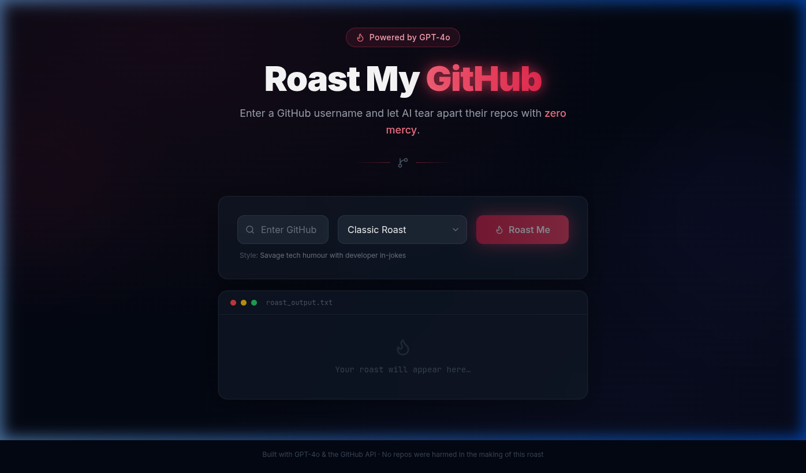

# 🔥 Roast My GitHub

An AI-powered roast generator that tears apart your GitHub profile with zero mercy.  
Enter any GitHub username, pick a style, and watch GPT-4o stream a personalised roast word-by-word.



---

## What it does

- **Fetches your public GitHub profile** — repos, languages, star counts, follower count, account age, and last-push dates via the GitHub REST API
- **Streams a roast from GPT-4o** using OpenAI's Server-Sent Events API, so the text appears word-by-word as it generates
- **Five roast styles** selectable from a dropdown:

  | Style | Persona |
  |---|---|
  | 🔥 Classic | Savage tech comedian — developer in-jokes, backhanded compliments |
  | 💼 Corporate Jargon | Passive-aggressive manager writing a performance review |
  | 🏴‍☠️ Pirate | Salty sea captain who somehow learned to code |
  | 🌸 Haiku | Contemplative haiku master — exactly 5 devastating 5-7-5 poems |
  | 🎭 Shakespearean | Elizabethan playwright who casts your repos as tragic plays |

- **Graceful error handling** — 404 shows *"Never heard of them. Try a real username."*, API failures show *"Something went wrong. Try again."*
- **Streaming UI** — blinking cursor while generating, copy-to-clipboard button when done
- **Dark theme** with glassmorphism cards, animated background blobs, and a cycling loading indicator

---

## Tech stack

- [React 19](https://react.dev) + [Vite](https://vite.dev)
- [Tailwind CSS v3](https://tailwindcss.com)
- [OpenAI API](https://platform.openai.com/docs) (`gpt-4o`, streaming)
- [GitHub REST API](https://docs.github.com/en/rest) (public endpoints, no auth required)
- [lucide-react](https://lucide.dev) for icons

---

## Running from a fresh clone

### 1. Clone and install

```bash
git clone https://github.com/blendshalaa/roast-my-github.git
cd roast-my-github
npm install
```

### 2. Set up environment variables

```bash
cp .env.example .env
```

Open `.env` and fill in your keys:

```env
# Required — get one at https://platform.openai.com/api-keys
VITE_OPENAI_API_KEY=sk-...

# Optional but recommended — raises GitHub rate limit from 60 to 5,000 req/hr
# Create one at https://github.com/settings/tokens (no scopes needed for public data)
VITE_GITHUB_TOKEN=ghp_...
```

> All variables must use the `VITE_` prefix so Vite exposes them to the browser bundle.

### 3. Start the dev server

```bash
npm run dev
```

Open [http://localhost:5173](http://localhost:5173).

### 4. Build for production

```bash
npm run build
npm run preview   # optional local preview of the built output
```

---

## Project structure

```
src/
├── App.jsx                   # Root — status machine (idle/loading/streaming/done/error)
├── main.jsx
├── index.css                 # Tailwind directives + custom glass, glow, and cursor styles
├── components/
│   ├── Header.jsx            # Title, badge, decorative separator
│   ├── RoastForm.jsx         # Username input, style dropdown, submit button
│   ├── RoastOutput.jsx       # Unified output panel — all states in one component
│   └── ErrorMessage.jsx      # Standalone dismissable error alert (used ad-hoc)
└── utils/
    ├── github.js             # Fetches user profile + up to 30 repos, typed error codes
    └── openai.js             # System/user prompts, SSE streaming, ROAST_STYLES config
```

---

## Prompts used

These are the exact prompts used to build this project with an AI coding assistant.

---

**Prompt 1 — App scaffold**

> Build a "Roast My GitHub" web app using React, Vite, and Tailwind. The user enters a GitHub username, picks a roast style from a dropdown (Classic, Corporate Jargon, Pirate, Haiku, Shakespearean), and clicks a button. The app fetches the user's public repos from the GitHub API, then sends that data to OpenAI (gpt-4o) to generate a streamed roast. Show the roast appearing word by word as it streams. Handle errors gracefully: user not found, private profile, API failure. Use a dark theme. Store the OpenAI key and optional GitHub token in a .env file with VITE_ prefix.

---

**Prompt 2 — OpenAI roast logic**

> Write the system + user prompt for roasting a GitHub user. The system prompt should switch persona based on roast style. The user prompt should include username, bio, follower count, account age in years, and a list of their recent repos with name, language, star count, and last pushed date. Tell the model to be specific, reference actual repos, keep it fun not cruel, and stay around 150-200 words.

---

**Prompt 3 — Polish**

> Add an empty state ("Your roast will appear here..." faded), a loading state that cycles through "Fetching your repos...", "Reading your commit shame...", "Preparing the roast..." every 1.5s, and error states (404 → "Never heard of them. Try a real username.", anything else → "Something went wrong. Try again."). Add .env.example with empty VITE_OPENAI_API_KEY and VITE_GITHUB_TOKEN vars. Make sure .env is in .gitignore.

---


## What I'd do with more time

- **Shareable links** — encode the username + style in the URL so roasts can be linked directly (e.g. `/roast/torvalds?style=Pirate`)
- **Roast history** — persist the last 5 roasts in `localStorage` with a sidebar to revisit them
- **Contribution graph analysis** — fetch the contributions calendar endpoint and factor in commit streaks, long dry spells, and "only commits on Mondays" patterns
- **Rate-limit feedback** — detect when the unauthenticated GitHub limit is hit and prompt the user inline to add a token, rather than surfacing a generic error
- **Server-side proxy** — move the OpenAI call to an Edge Function (Vercel/Cloudflare) to keep the API key off the client entirely
- **More styles** — *ELI5*, *LinkedIn Influencer*, *Ancient Philosopher*, *Gordon Ramsay*
- **Roast score** — a tongue-in-cheek "Dev Shame Index" score (0–100) generated alongside the roast
- **TypeScript** — the codebase is small enough that adding strict types to the GitHub API response shapes and the status machine would be straightforward and worth it
